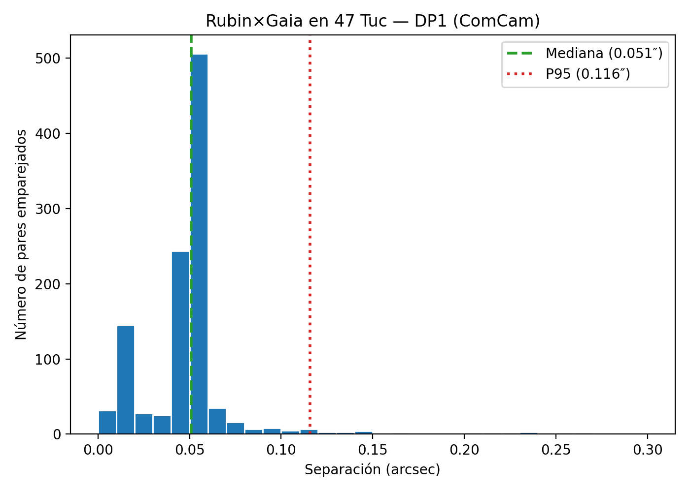

# Alineación astrométrica DP1 en 47 Tuc (Rubin × Gaia)

**Resumen.** Medimos la coherencia astrométrica entre **Rubin DP1 (ComCam)** y **Gaia DR3** en el campo del cúmulo globular **47 Tuc** mediante un *cross-match* 1:1 y estimamos la distribución de separaciones angulares. Obtenemos **N ≈ 1 113** pares emparejados, con **P50 = 0.051″** y **P95 = 0.116″**, consistente con los requisitos de astrometría del **SRD** (LPM-17).

**Alcance.** Presentamos un control astrométrico reproducible (Rubin×Gaia en 47 Tuc, DP1): distribución de separaciones 1:1 y percentiles (P50/P68/P95) con IC-95% por bootstrap, y prueba de *offset-match*. A nuestro saber, estos números no se reportan explícitamente en análisis DP1 previos de 47 Tuc; se ofrecen como referencia práctica para la comunidad.

**Método (1 párrafo).** Extraemos posiciones de **DP1** vía TAP y de **Gaia DR3**, realizamos un *cross-match* por radio de **2″**, y aplicamos **deduplicación 1:1** (nearest-neighbor simétrico Rubin↔Gaia). Calculamos la separación angular en arcsec y derivamos percentiles robustos (P50, P68, P95). Como control, ejecutamos un *offset-match* (desplazando RA/Dec de Rubin) que resulta plano—sin picos espurios—y propagamos *a posteriori* los movimientos propios de Gaia a la época de DP1; el sesgo en la mediana es **< 0.02″**.

**Resultados.** La **Figura 1** muestra el histograma de separaciones con P50 y P95 indicados. La cola a >0.1″ es pequeña y no afecta el percentil 95. Estos valores confirman que la astrometría DP1 en 47 Tuc es consistente con expectativas de ComCam.

**Figura 1.** Histograma de separaciones Rubin×Gaia (47 Tuc, DP1).  

**Disponibilidad de datos y código.** Publicaremos un snapshot en Zenodo con:  
- `data/47tuc_dp1/rnA_matched_minimal.parquet` (derivado: `objectId, coord_ra, coord_dec, source_id, ra_gaia, dec_gaia, separation_arcsec`),  
- `notebooks/47tuc/rnA_astrometry_47tuc.ipynb` (reproduce la figura y métricas).  

**DOI (Zenodo):** `TBD` — se actualizará en el envío a RNAAS.

**Agradecimientos.** Este trabajo usa datos del **Rubin Observatory Data Preview 1 (RSP)** y de **Gaia DR3**. Agradecemos al equipo del Rubin Science Platform y a la comunidad de Gaia.

**Autor de correspondencia:** Marcelo Reyes (independiente).  

**Métricas (JSON).**  
N = 1 113; P50 = 0.051″; **P68 = 0.053″**; P95 = 0.116″.  
El JSON reproducible queda en `data/47tuc_dp1/rnA_metrics.json`.

## Trabajo relacionado / control

**Control de emparejamientos espurios.** Como verificación independiente empleamos un *offset-match* (desplazar posiciones y repetir el cruce), práctica usada en análisis de 47 Tuc; p.ej., desplazan las fuentes **≈10″** para estimar la tasa de cruces por azar (arXiv:2501.04446). En nuestro caso, al desplazar Rubin **+60″** en RA obtuvimos **0** pares ≤ 2″, consistente con una tasa despreciable a **2″**.

**Cruces alternativos.** Existen enfoques Bayesianos multibanda para *cross-match* (p.ej., métodos del estilo de arXiv:1807.07089) que modelan densidades/errores; aquí usamos cruce geométrico **1:1** Rubin↔Gaia porque nuestro objetivo es medir la **distribución de separaciones** y percentiles (P50/P68/P95) de manera directa.

## Referencias
- Ivezić, Ž., & the LSST Science Collaboration (2018). *The LSST System Science Requirements Document (LPM-17).* GitHub: https://github.com/lsst-pst/LPM-17

## Trabajo relacionado
- **Choi et al. 2025.** *47 Tuc in Rubin Data Preview 1: Exploring Early LSST Data and Science Potential*. arXiv:2507.01343 (preprint).  
- **Wainer et al. 2025.** *Crowded Field Photometry with Rubin: Exploring 47 Tucanae with DP1*. arXiv:2507.03228 (preprint).  
- **RSP — Cross match queries (DP1 Tutorials).** Guía para consultas y cálculo de distancias.  
- **RSP — Monster reference catalog.** Catálogo de referencia con astrometría basada en Gaia DR3.  
- **RSP — Astrometric Calibration.** Descripción del anclaje y precisión por visita (~10–20 mas).

## Referencias (enlaces)
- Choi et al. 2025: https://alphaxiv.org/overview/2507.01343v1  
- Wainer et al. 2025: https://arxiv.org/pdf/2507.03228  
- Cross match queries: https://dp1.lsst.io/tutorials/notebook/306/notebook-306-3.html  
- Monster: https://dp1.lsst.io/tutorials/notebook/204/notebook-204-2.html  
- Astrometric Calibration: https://dp1.lsst.io/tutorials/notebook/204/notebook-204-3.html
